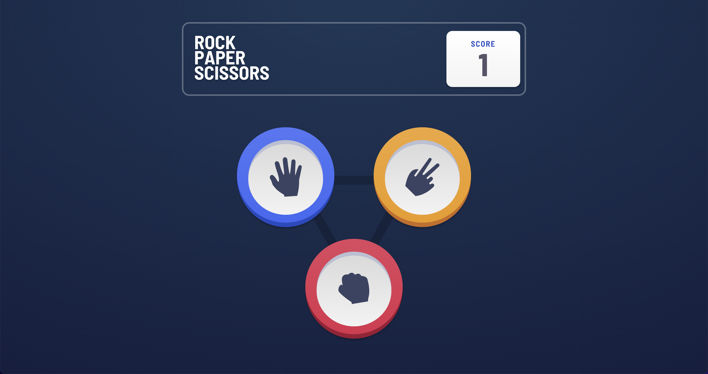

# Frontend Mentor - Rock, Paper, Scissors solution

This is a solution to the [Rock, Paper, Scissors challenge on Frontend Mentor](https://www.frontendmentor.io/challenges/rock-paper-scissors-game-pTgwgvgH). Frontend Mentor challenges help you improve your coding skills by building realistic projects. 

## Table of contents

- [Overview](#overview)
  - [The challenge](#the-challenge)
  - [Screenshot](#screenshot)
  - [Links](#links)
  - [Available Scripts](#available-scripts)
- [My process](#my-process)
  - [Built with](#built-with)
  - [What I learned](#what-i-learned)
  - [Continued development](#continued-development)
  - [Useful resources](#useful-resources)
- [Author](#author)
- [Acknowledgments](#acknowledgments)


## Overview

### The challenge

Users should be able to:

- View the optimal layout for the game depending on their device's screen size
- Play Rock, Paper, Scissors against the computer
- Maintain the state of the score after refreshing the browser _(optional)_

### Screenshot



### Links

- [See it in action !](https://lucas-rossolini.github.io/rock-paper-scissor-game/)


## Available Scripts
This project was bootstrapped with [Create React App](https://github.com/facebook/create-react-app).

In the project directory, you can run:

### `npm start`

Runs the app in the development mode.\
Open [http://localhost:3000](http://localhost:3000) to view it in the browser.

The page will reload if you make edits.\
You will also see any lint errors in the console.

### `npm run build`

Builds the app for production to the `build` folder.\
It correctly bundles React in production mode and optimizes the build for the best performance.

The build is minified and the filenames include the hashes.\
Your app is ready to be deployed!

See the section about [deployment](https://facebook.github.io/create-react-app/docs/deployment) for more information.


## My process

### Built with

- Semantic HTML5 markup
- CSS custom properties
- Flexbox
- CSS Grid
- Mobile-first workflow
- [React](https://reactjs.org/) - JS library
- [CSS modules](https://github.com/css-modules/css-modules) - For styles
- [Create-react-app](https://create-react-app.dev/)

### What I learned

This was my first react project so I learned a ton over the course of this project, to name a few things:
  - React Hooks
      - useState
         - lazy mode
      - useEffect
      - useRef
  - How to handle state changes and structure around state

I encountered many problems to create a function that would randomize the computer player's selection after the user picks its selection. The problem came from working with react and how state changes work.

 The solution in the end was to use lazy mode useState which will only set the state once and every rerender after that will leave it the same. The end solution looks like below. To use lazy mode in useState you need to pass the default value a callback function.

```js
function randomPick() {
  const pick = Math.round(Math.random() * 3);
  return pick === 0 ? 'paper' : pick === 1 ? 'scissors' : 'rock';

  const [ComputerSelection] = useState(() => randomPick());
}
```

### Continued development

 I still have a lot to learn with react, my teacher helped me a lot with props. In the future i'm going to do a little more planning before jumping in. By doing a little planning in the front I could avoid some back tracking but it was a good lesson and something I'll remember.

### Useful resources

Some of the articles that helped me:

- [useState lazy initialization and function updates](https://kentcdodds.com/blog/use-state-lazy-initialization-and-function-updates)
- [When to break up a component into multiple components](https://kentcdodds.com/blog/when-to-break-up-a-component-into-multiple-components)
- [Colocation](https://kentcdodds.com/blog/colocation)
- [State Colocation will make your React app faster](https://kentcdodds.com/blog/state-colocation-will-make-your-react-app-faster)
- [Application State Management with React](https://kentcdodds.com/blog/application-state-management-with-react)
- [Fix the slow render before you fix the re-render](https://kentcdodds.com/blog/fix-the-slow-render-before-you-fix-the-re-render)

## Author

- Github - [Lucas Rossolini](https://github.com/lucas-rossolini)


